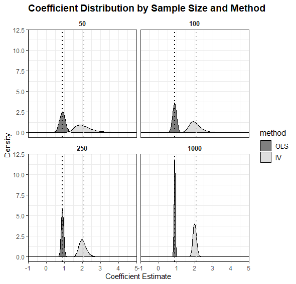
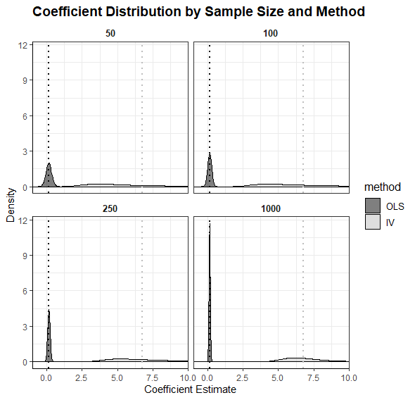

```{r setup, include=FALSE}
knitr::opts_chunk$set(echo = TRUE)


theme_set(theme_classic())
```

## Question 1: Theory
Show that, without perfect compliance, the Intention-to-treat effect will be smaller than the

ITT and ATE are two methods used to estimate the impact of a treatment. 


Without perfect compliance outcomes are not homogeneous. To account for heterogeneous outcomes we can delineate our binary treatment indicator ($D_i$) by those who are and are not affected by the binary instrument ($Z_i$):

* $D_1i$ when $Z_i= 1$
* $D_0i$ when $Z_i= 0$

$i$ represents the treatment status ($D_i$) when the instrument ($Z_i$) takes one of the two binary values.

We can represent the observed treatment status in the switching equation:

$$D_i=D_{0i}+(D_{1i}-D_{0i})Z_i\ (Equation \ 1)$$ 
When $Z_i=1$, $D_i$ takes on the value $D_{1i}$, as the $D_{0i}$ cancel. When $Z_i=0$, $D_i$ takes on the value $D_{0i}$, the second terms disappears, leaving $D_{0i}$. 

We can rewrite this equation in regression form as:

$$\delta_{0}+\delta_{1i}Z_i+\eta_i$$

However $\delta_{1i}$ is not uniform for all individuals in the sample. Those who have a high $\delta$ are encouraged or discouraged by $Z_i$. But those with a low $\delta$ are less affected by $Z_i$. 

There population can be divided into four groups. Those who are unaffected by the instrument ($Z_i$):

* Always-Takers: People who always take the treatment. $D_{1i}=D_{0i}=1$.
* Never-Takers: People who never take the Treatment. $D_{1i}=D_{0i}=0$.

Additionally, there are those who are affected by the instrument. 
* Compliers: Those influenced by the instrument ($Z_i$) as expected. $D_{1i}=1\ and\ D_{0i}=0$.
* Defiers: Those influenced by the instrument ($Z_i$) unexpectedly. $D_{1i}=0\ and\ D_{0i}=1$.


## Question 2: Simulation Excercise

The following 5 steps were used to generate the toy data:

1. Generate a pool of 100,000 observations that meet the specified criteria
2. Draw 10,000 samples of varying sizes from the pool for each sample size
3. Conduct OLS and IV on each sample to obtain the beta coefficients
4. Compute the mean of the beta coefficients for each sample size by estimator
5. Plot the results

The process to generate the data is the same aside from modifications to parameter correlations.

### Q2 - Part A
The plot below displays the distribution of estimated $\beta$ coefficients for $x$ based on sample size and method. The sample sizes are arranged in an increasing order, with the sample size of 50 appearing in the top left and the sample size of 1000 in the bottom right. OLS coefficients are shown in black and IV estimates of $\beta$ in light grey. A dotted line in the same color highlights the mean $\beta$ coefficient.



The target value for $\beta$ is 1, but the results from the OLS method are affected by the correlation between variables $x$ and $\epsilon$. As the sample size increases, the OLS estimates for $\beta$ converge towards 0.90 from below, while the estimates from the IV method approach 2 from above when the sample size reaches 1000.

If the error term $\epsilon$ were independently and identically distributed, the OLS method would produce a $\beta$ coefficient of 1. However, due to the positive correlation of 40% between $x$ and $\epsilon$, the OLS estimate is biased downward, resulting in a $\beta$ coefficient approaching 0.9. In contrast, the IV method suggests that the true effect of $x$ on $y$ is approaching 2.

The OLS estimates may be biased due to endogeneity, and thus do not converge on the "true" value of $\beta$. However, they converge faster and with less variance than IV estimates, and with increased concentration on the mean. The IV estimator is more prone to producing extreme $\beta$ coefficients, particularly in small samples of 50 or 100, as demonstrated by a highest estimate of $\beta_{IV}=1541$.

These findings suggest that more data is needed for reliable IV estimates. The distribution of IV coefficients for samples of 1000 is similar in shape and peakedness to the distributions of OLS for samples of 100. From this comparison, it may be more efficient to address omitted variable bias through the inclusion of additional data when possible, rather than relying on IV estimators as a first solution.

### Q2 - Part B
The data in the plot 2b shows the results that are consistent with those in Part A. The only difference is the modification to the correlations in the data that have weakened the instrument $z$.



Previously, we stated that the target value for $\beta$ was 1, but the results from the OLS method were affected by the correlation between variables $x$ and $\epsilon$. This remains the same. As the sample size increases, the OLS estimates for $\beta$ converge towards 0.55 from below, while the estimates from the IV method approach 7 as the sample size reaches 1000. However, the mean for the IV now jumps erratically as the correlation between $x$ and $Z$ has weakened.

If the error term $\epsilon$ were independent and identically distributed, the OLS method would have produced a $\beta$ coefficient of 1. However, due to the positive correlation of 40% between $x$ and $\epsilon$, the OLS estimate is biased downwards, resulting in a $\beta$ coefficient of 0.55. On the other hand, the IV method suggests that the true effect of $x$ on $y$ is approaching 7, but the IV estimate is less consistent as the sample size increases, with more erratic results.

The OLS estimates may be biased due to endogeneity, but they converge faster and with less variance compared to the IV estimates. However, this difference is even more pronounced now that the instrument has been weakened. The IV estimator tends to produce more extreme $\beta$ coefficients, especially in small samples of 50 or 100, as demonstrated by the highest estimate of $\beta_{IV}=1541$. The peakedness of these distributions is significantly lower compared to Part A.

These results indicate that IV estimators may not be as reliable as OLS estimators, even if they are biased, unless you have a powerful instrument that allows you to obtain reasonable, reliable estimates. The strength of the instrument should be considered along with the sample size available to achieve reliable estimation.