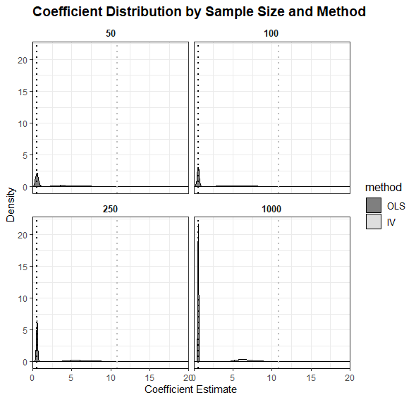

```{r setup, include=FALSE}
knitr::opts_chunk$set(echo = TRUE)


```

## Question 1: Theory

### Question 1: Part A
The Intention-To-Treat effect is defined as $\mathbb{E}(Y\mid D=1)-\mathbb{E}(Y\mid D=0)$.$\mathbb{E}(Y\mid D=1)$. is the expected value of $Y$ given that they are in the treatment group.$\mathbb{E}(Y\mid D=0)$. is the expected value of $Y$ given that they are in the control group. It does not consider whether those assigned to treatment or control are actually treated.

The Average Treatment Effect is defined as $\mathbb{E}(Y\mid D=1,Z=1)-\mathbb{E}(Y\mid D=0, Z=0)$.$\mathbb{E}(Y\mid D=1,Z=1)$ where the expected value of $y$ given the individual is assigned to the treatment group and is assigned to treatment. $\mathbb{E}(Y\mid D=0,Z=0)$ is the expected value of $Y$ is assigned to the control group and does not receive treatment.

The ITT and ATE are equivalent under perfect compliance as all those assigned to treatment, receive treatment: 
$\mathbb{E}(Y\mid D=1)-\mathbb{E}(Y\mid D=0)=\mathbb{E}(Y\mid D=1,Z=1)-\mathbb{E}(Y\mid D=0, Z=0)$

If compliance is imperfect, The ITT is smaller than the ATE as not all those assigned to treatment group receive treatment. This reduces the average treatment among those assigned to the treatment group. 

$\mathbb{E}(Y\mid D=1)-\mathbb{E}(Y\mid D=0)<\mathbb{E}(Y\mid D=1,Z=1)-\mathbb{E}(Y\mid D=0, Z=0)$

If the individuals in the treatment group are not receiving treatment the difference in outcomes between treatment and control groups is smaller than if everyone was fully compliant. This overstates the true treatment effect because observed treatment effects are based on comparing outcomes between fully compliant groups. 


### Question 2: Part B
Under Local Average Treatment Effect  assumptions, the Wald Estimand provides an estimate of the Average Treatment Effect on the Treated (ATT), if $\mathbb{E}[Di|Zi = 0] = Pr(Di = 1|Zi = 0) = 0$.

The LATE assumptions require that treatment is as good as random within the compliers. Individuals who would have taken the treatment if assigned to it,"compliers", are the only ones affected by the treatment. 

$\mathbb{E}[Di|Zi = 0] = 0$ implies  no individuals in the control group who would have taken the treatment if assigned to it, which is a necessary for the LATE assumptions to hold.

ATT is the expected difference in outcomes between individuals who are assigned to the treatment group *AND* take the treatment, and individuals who are assigned to the control group *AND* do not take the treatment. By definition, the ATT can be expressed as:

$$ATT = \mathbb{E}[Yi|Zi = 1, Di = 1] − \mathbb{E}[Yi|Zi = 0, Di = 0]$$

Substituting the expectations from the Wald Estimand into this definition, we have:

 $= \dfrac{(\mathbb{E}[Yi|Zi = 1] − \mathbb{E}[Yi|Zi = 0])}{(\mathbb{E}[Di|Zi = 1] − \mathbb{E}[Di|Zi = 0])}$

As $\mathbb{E}[Di|Zi = 0] = 0$, we can simplify the denominator to:

 $= \dfrac{\mathbb{E}[Yi|Zi = 1] − \mathbb{E}[Yi|Zi = 0]}{\mathbb{E}[Di|Zi = 1]}$

Therefore, under the LATE assumptions and $\mathbb{E}[Di|Zi = 0] = 0$, the Wald Estimand provides an estimate of the Average Treatment Effect on the Treated (ATT).

### Question 2: Part C(I)
In the presence of defiers the IV estimand is given by: 

$$\beta_{IV}=\mathbb{E}[Y_i|D_i=1, complier]-\mathbb{E}[Y_i|D_i=0, complier]+(1-\pi_c)(\mathbb{E}[Y_i|D_i=0, defier]-\mathbb{E}[Y_i|D_i=1, defier]$$
Wehere $\pi_c$ is the share of compliers. $\mathbb{E}[Y_i|D_i=x, complier/defier]$ identifies the expected value of Y_i given that the individual is assigned to treatment x and is either a complier or defier.

The adapted estimand accounts for individuals who do not comply with assignment and therefore whose outcomes are not attributable to treatment. 

### Question 2: Part C(II) <- ChatGPT Solution, not sure if correct
If $\pi_d=a\pi_c$ with $0<a<1$. The implication is that deifers are are a share of compliers. If $B_{IV}>0$ treatment must have some positive effect on compliers. If the share of defiers is in fact proportional to the share of compliers, then the additional effect of treatment is likely positive. In this case the overall effect of treatment is liekly to be positive as well, but dilluted by the presence of defiers. However this result is not guaranteed and depends on the data and the assumptions made about the effect of treatment on the defiers
## Question 2: Simulation Excercise

The following 5 steps were used to generate the toy data:

1. Generate a pool of 100,000 observations that meet the specified criteria
2. Draw 10,000 samples of varying sizes from the pool for each sample size
3. Conduct OLS and IV on each sample to obtain the beta coefficients
4. Compute the mean of the beta coefficients for each sample size by estimator
5. Plot the results

The process to generate the data is the same aside from modifications to parameter correlations.

### Q2 - Part A
The plot below displays the distribution of estimated $\beta$ coefficients for $x$ based on sample size and method. The sample sizes are arranged in an increasing order, with the sample size of 50 appearing in the top left and the sample size of 1000 in the bottom right. OLS coefficients are shown in black and IV estimates of $\beta$ in light grey. A dotted line in the same color highlights the mean $\beta$ coefficient.


The target value for $\beta$ is 1, but the results from the OLS method are affected by the correlation between variables $x$ and $\epsilon$. As the sample size increases, the OLS estimates for $\beta$ converge towards 0.90 from below, while the estimates from the IV method approach 2 from above when the sample size reaches 1000.

If the error term $\epsilon$ were independently and identically distributed, the OLS method would produce a $\beta$ coefficient of 1. However, due to the positive correlation of 40% between $x$ and $\epsilon$, the OLS estimate is biased downward, resulting in a $\beta$ coefficient approaching 0.9. In contrast, the IV method suggests that the true effect of $x$ on $y$ is approaching 2.

The OLS estimates may be biased due to endogeneity, and thus do not converge on the "true" value of $\beta$. However, they converge faster and with less variance than IV estimates, and with increased concentration on the mean. The IV estimator is more prone to producing extreme $\beta$ coefficients, particularly in small samples of 50 or 100, as demonstrated by a highest estimate of $\beta_{IV}=1541$.

These findings suggest that more data is needed for reliable IV estimates. The distribution of IV coefficients for samples of 1000 is similar in shape and peakedness to the distributions of OLS for samples of 100. From this comparison, it may be more efficient to address omitted variable bias through the inclusion of additional data when possible, rather than relying on IV estimators as a first solution.

### Question 2: Part B
The data in the plot 2b shows the results that are consistent with those in Part A. The only difference is the modification to the correlations in the data that have weakened the instrument $z$.



Previously, we stated that the target value for $\beta$ was 1, but the results from the OLS method were affected by the correlation between variables $x$ and $\epsilon$. This remains the same. As the sample size increases, the OLS estimates for $\beta$ converge towards 0.55 from below, while the estimates from the IV method approach 7 as the sample size reaches 1000. However, the mean for the IV now jumps erratically as the correlation between $x$ and $Z$ has weakened.

If the error term $\epsilon$ were independent and identically distributed, the OLS method would have produced a $\beta$ coefficient of 1. However, due to the positive correlation of 40% between $x$ and $\epsilon$, the OLS estimate is biased downwards, resulting in a $\beta$ coefficient of 0.55. On the other hand, the IV method suggests that the true effect of $x$ on $y$ is approaching 7, but the IV estimate is less consistent as the sample size increases, with more erratic results.

The OLS estimates may be biased due to endogeneity, but they converge faster and with less variance compared to the IV estimates. However, this difference is even more pronounced now that the instrument has been weakened. The IV estimator tends to produce more extreme $\beta$ coefficients, especially in small samples of 50 or 100, as demonstrated by the highest estimate of $\beta_{IV}=1541$. The peakedness of these distributions is significantly lower compared to Part A.

These results indicate that IV estimators may not be as reliable as OLS estimators, even if they are biased, unless you have a powerful instrument that allows you to obtain reasonable, reliable estimates. The strength of the instrument should be considered along with the sample size available to achieve reliable estimation.